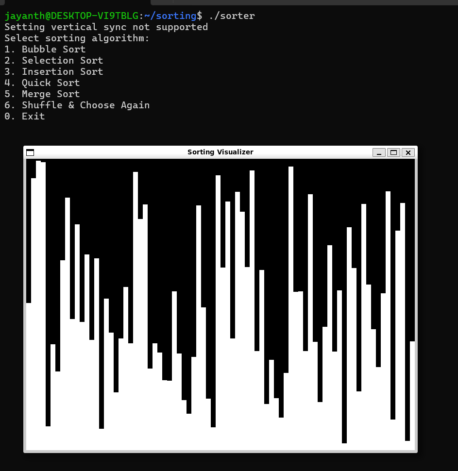

# Sorting Visualizer

A simple C++ application using SFML to visualize different sorting algorithms.

## Features
- Supports Bubble Sort, Selection Sort, Insertion Sort, Quick Sort, and Merge Sort.
- Graphical visualization of sorting steps.
- Option to shuffle the dataset and choose sorting algorithm again.
- Highlights active comparisons in red.

## Installation
### Prerequisites
- SFML Library installed on your system
- g++ compiler

### Compile and Run
```sh
# Compile the program
 g++ -o sorter main.cpp -lsfml-graphics -lsfml-window -lsfml-system

# Run the program
./sorter
```

## Usage
1. Run the executable.
2. Choose a sorting algorithm from the menu.
3. Watch the sorting process in real-time.
4. Shuffle and choose another algorithm if needed.
5. Exit when done.

## Screenshot
  


## License
This project is open-source and available under the MIT License.

